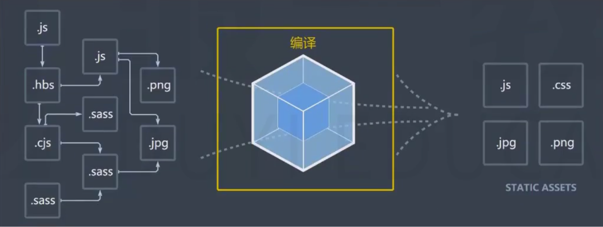
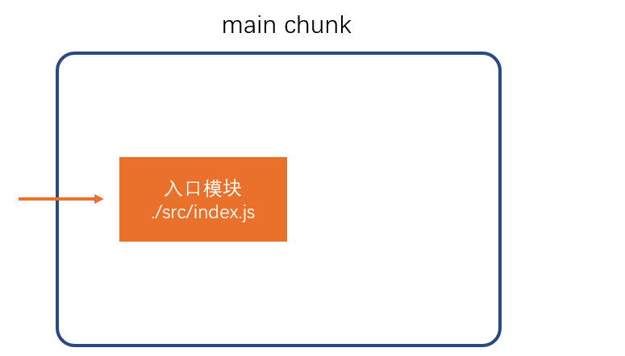
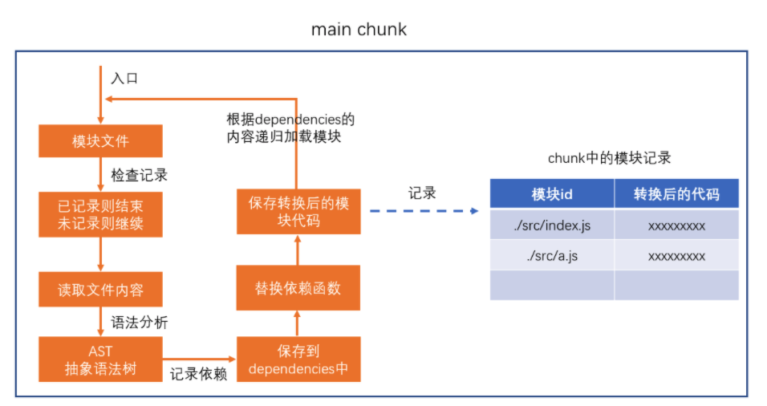
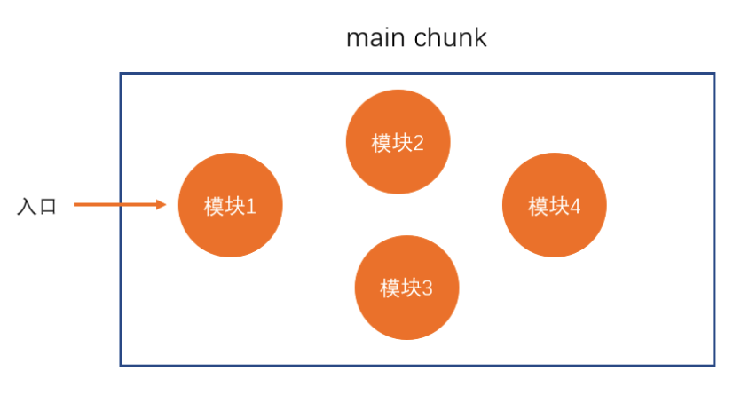
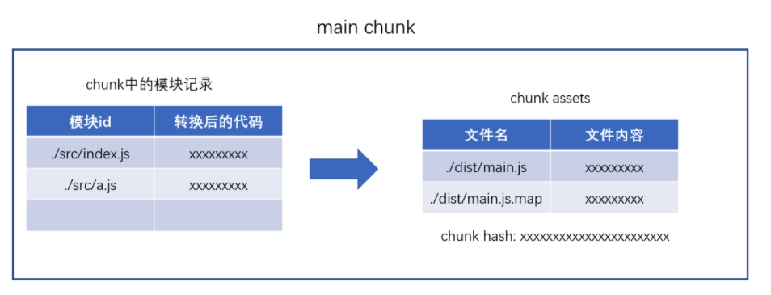
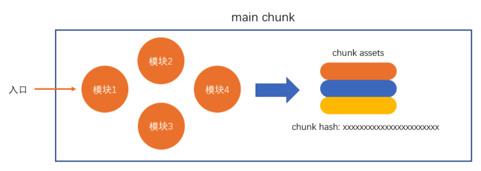
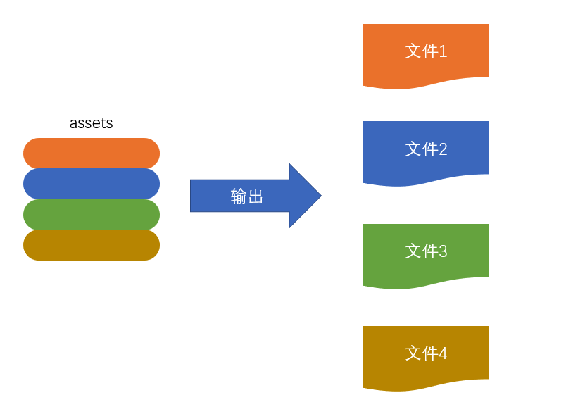
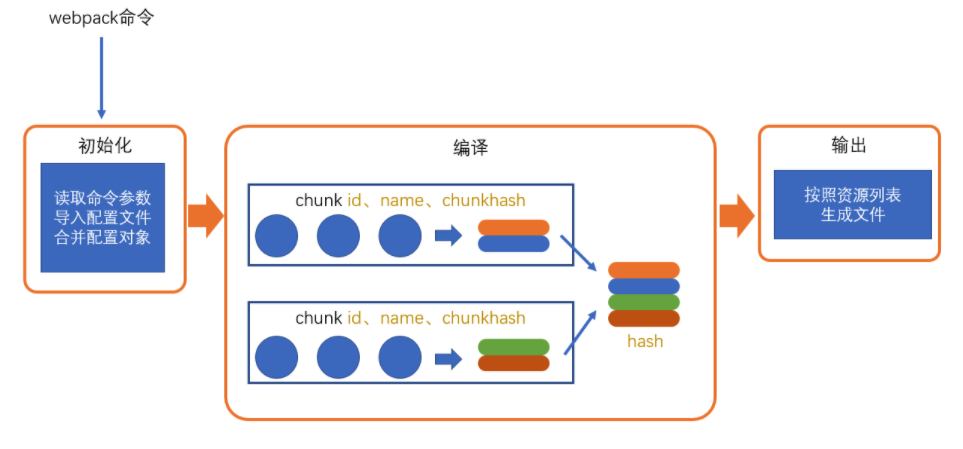

# 

# webpack 编译过程

webpack 的作用是将源代码编译（`构建、打包`）成最终代码。

**整个过程大致分为三个步骤：**

1. 初始化
2. 编译
3. 输出

## 初始化

此阶段，webpack会将**CLI参数**、**配置文件**、**默认配置**进行融合，形成一个最终的配置对象。

对配置的处理过程是依托一个第三方库`yargs` 融合配置）完成的。

此阶段相对比较简单，主要是为接下来的编译阶段做必要的准备。

目前，可以简单的理解为，初始化阶段主要用于产生一个最终的配置。

## 编译

###**创建chunk**

> chunk是webpack在内部构建过程中的一个概念，译为`块`，它表示通过某个入口找到的所有依赖的统称。
>
> 
>
> 根据入口模块（默认为`./src/index.js`）创建一个chunk。

- 每个chunk都有至少两个属性

> name：默认为main。
> id：唯一编号。开发环境和name相同，生产环境是一个数字，从0开始。

## **构建所有依赖模块**

> `index.js`

    console.log("index")
    require("./a");

> 入口：`./src/index.js` 。
>
> 
>
>
> 模块文件：首先拿到的是入口模块的文件路径，`./src/index.js`
>
> 
>
>
> 检查记录：检查模块 `/src/index.js` 是否以加载（有一张表格记录 模块id和模块代码），已加载则结束，未加载则继续。
>
> 
>
>
> 读取文件内容：`require('./a');`
>
> 
>
>
> 语法分析：把文件内容转化为抽象语法树。AST--》树形结构遍历--》找到所有依赖

> AST在线测试工具：[https://astexplorer.net/](https://astexplorer.net/)
>
> 
>
>
> 记录依赖：完整相对路径（模块i的方式）的方式记录到一个数组中，`['./src/a.js']`
>
> 
>
>
> 替换依赖函数：`__webpack_require`  替换`require`，形成了转换后的模块代码
>
> 
>
> 
>
>
> 保存转换后的模块代码：把转换后的模块代码进行保存，保存到表格中。
>
> 
>
> 
>
>
> 根据dependencies 的内容递归加载模块：递归查找dependencies数组中的模块文件。

- 简图

## **产生chunk assets**

在第二步完成后，chunk中会产生一个模块列表，列表中包含了**模块id**和**模块转换后的代码**。

接下来，webpack会根据配置为chunk生成一个资源列表，即`chunk assets`，资源列表可以理解为是生成到最终文件的文件名和文件内容。

chunk hash：是根据所有chunk assets的内容生成的一个hash字符串。

hash：一种算法，具体有很多分类，特点是将一个任意长度的字符串转换为一个固定长度的字符串，而且可以保证原始内容不变，产生的hash字符串就不变。

- 简图

## **合并chunk assets**

将多个`chunk assets`合并到一起，并产生一个总的hash`assets` 。

## 输出

此步骤非常简单，webpack将利用node中的fs模块（文件处理模块），根据编译产生的总的`assets`，生成相应的文件。

# 总过程

**涉及术语：**

1. `module`：模块，分割的代码单元，webpack中的模块可以是任何内容的文件，不仅限于JS
2. `chunk`：webpack内部构建模块的块，一个chunk中包含多个模块，这些模块是从入口模块通过依赖分析得来的
3. `bundle`：chunk构建好模块后会生成chunk的资源清单，清单中的每一项就是一个bundle，可以认为bundle就是最终生成的文件
4. `hash`：最终的资源清单所有内容联合生成的hash值
5. `chunkhash`：chunk生成的资源清单内容联合生成的hash值
6. `chunkname`：chunk的名称，如果没有配置则使用main
7. `id`：通常指chunk的唯一编号，如果在开发环境下构建，和chunkname相同；如果是生产环境下构建，则使用一个从0开始的数字进行编号

# 输出解读

1. hash

> 最终的资源列表生成的hash值。

2. 最终的资源列表

> Asset：资源。

> Size：资源大小。

> Chunks：chunk 的id，emitted 表示已经生成（已经输出成文件）。

> Chunk Names:chunk 名称。

3. `Entrypoint 入口： 输出`

> Entrypoint main（chunk 名字）：main 这个chunk最终生成的文件， `main.js 、main.js.map` 。

4. 加载过程

